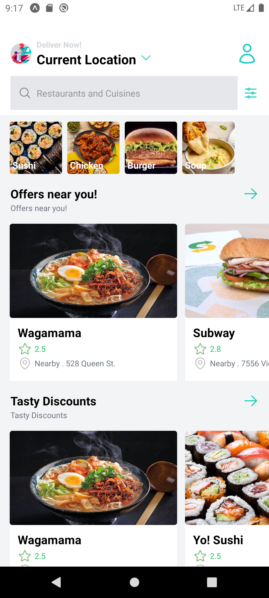
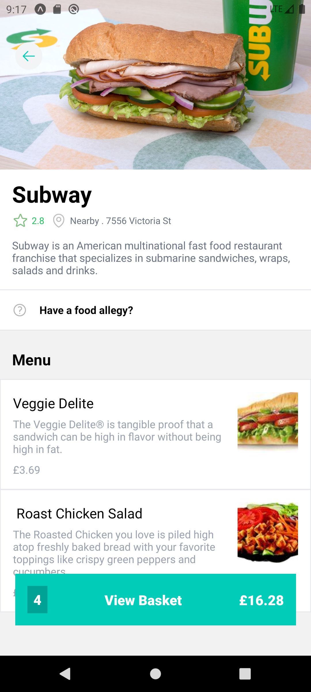
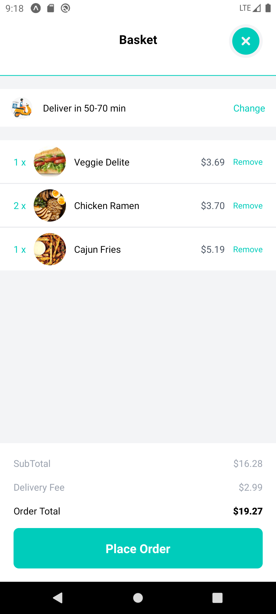
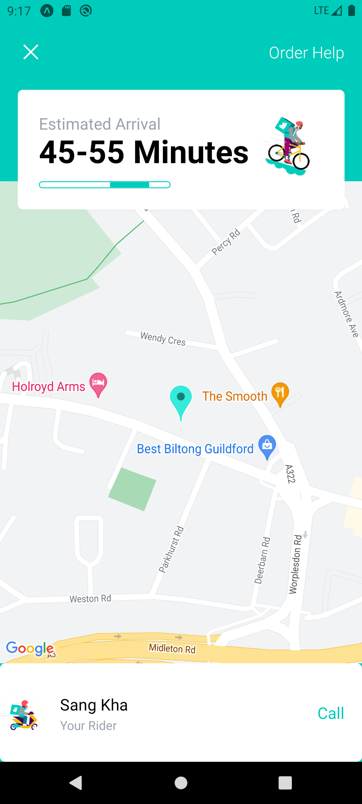

<!--
Hey, thanks for using the awesome-readme-template template.  
If you have any enhancements, then fork this project and create a pull request 
or just open an issue with the label "enhancement".

Don't forget to give this project a star for additional support ;)
Maybe you can mention me or this repo in the acknowledgements too
-->
<div align="center">

  
  <h1>Deliveroo Clone</h1>
  
  <p>
    Food for everybody !
  </p>
  
  
<!-- Badges -->
<!--<p>
  <a href="https://github.com/Louis3797/awesome-readme-template/graphs/contributors">
    
  </a>
  <a href="">
    
  </a>
  <a href="https://github.com/Louis3797/awesome-readme-template/network/members">
    
  </a>
  <a href="https://github.com/Louis3797/awesome-readme-template/stargazers">
    
  </a>
  <a href="https://github.com/Louis3797/awesome-readme-template/issues/">
    
  </a>
  <a href="https://github.com/Louis3797/awesome-readme-template/blob/master/LICENSE">
    
  </a>
</p>
   
<h4>
    <a href="https://github.com/Louis3797/awesome-readme-template/">View Demo</a>
  <span> · </span>
    <a href="https://github.com/Louis3797/awesome-readme-template">Documentation</a>
  <span> · </span>
    <a href="https://github.com/Louis3797/awesome-readme-template/issues/">Report Bug</a>
  <span> · </span>
    <a href="https://github.com/Louis3797/awesome-readme-template/issues/">Request Feature</a>
  </h4>-->
</div>

<br />

<!-- Table of Contents -->
# :notebook_with_decorative_cover: Table of Contents

- [About the Project](#star2-about-the-project)
  * [Screenshots](#camera-screenshots)
  * [Tech Stack](#space_invader-tech-stack)
  * [Features](#dart-features)
  * [Color Reference](#art-color-reference)
- [Getting Started](#toolbox-getting-started)
  * [Prerequisites](#bangbang-prerequisites)
  * [Installation](#gear-installation)
  * [Run Locally](#running-run-locally)
- [Contact](#handshake-contact)
- [Acknowledgements](#gem-acknowledgements)

  

<!-- About the Project -->
## :star2: About the Project


<!-- Screenshots -->
### :camera: Screenshots

<div align="center" style="display: inline_block"> 
  
  
  
  
</div>


<!-- TechStack -->
### :space_invader: Tech Stack

<details>
  <summary>Client</summary>
  <ul>
    <li><a href="https://www.javascript.com/">Javascript</a></li>
    <li><a href="https://reactnative.dev/">React Native</a></li>
    <li><a href="https://redux-toolkit.js.org/tutorials/quick-start">Redux</a></li>
    <li><a href="https://tailwindcss.com/">NativeWind (TailwindCSS)</a></li>
  </ul>
</details>

<!--
<details>
  <summary>Server</summary>
  <ul>
    <li><a href="https://www.typescriptlang.org/">Typescript</a></li>
    <li><a href="https://expressjs.com/">Express.js</a></li>
    <li><a href="https://go.dev/">Golang</a></li>
    <li><a href="https://nestjs.com/">Nest.js</a></li>
    <li><a href="https://socket.io/">SocketIO</a></li>
    <li><a href="https://www.prisma.io/">Prisma</a></li>    
    <li><a href="https://www.apollographql.com/">Apollo</a></li>
    <li><a href="https://graphql.org/">GraphQL</a></li>
  </ul>
</details>

<details>
<summary>Database</summary>
  <ul>
    <li><a href="https://www.mysql.com/">MySQL</a></li>
    <li><a href="https://www.postgresql.org/">PostgreSQL</a></li>
    <li><a href="https://redis.io/">Redis</a></li>
    <li><a href="https://neo4j.com/">Neo4j</a></li>
    <li><a href="https://www.mongodb.com/">MongoDB</a></li>
  </ul>
</details>
-->

<details>
<summary>Server & Backend</summary>
  <ul>
    <li><a href="https://www.sanity.io/">SanityIO</a></li>
  </ul>
</details>

<!-- Features -->
### :dart: Features

- Screenshot 1; View all restaurants (categorized) and dishes.
- Screenshot 2: View information of a restaurant (menu, price,..).
- Screenshot 3: View basket status (quantity, total price,..).
- Screenshot 4: View ordering status (map, driver,...).

<!-- Color Reference -->
### :art: Color Reference

| Color             | Hex                                                                |
| ----------------- | ------------------------------------------------------------------ |
| Primary Color |  #00CCD8 |
| Secondary Color |  #00CCBB |
| Text Color |  #EEEEEE |


## :toolbox: Getting Started

### :bangbang: Prerequisites

- Sign up for a Sanity account <a href='https://www.sanity.io'>HERE</a>
- Install Node JS in your computer <a href='https://nodejs.org/en/'>HERE</a>

### :gear: Installation


Install my-project with expo


Installing Expo CLI

```
npm install --global expo-cli
```

Initializing the project

```
npx create-expo-app deliveroo-clone
```

```
cd deliveroo-clone
```

Install dependencies

### Setup Tailwind CSS


```
npm install tailwindcss-react-native
npm install --save-dev tailwindcss
```

Tailwindcss requires a `tailwind.config.js` file with the content section configured to include the paths to all of your components and any other source files that contain Tailwind class names.

```
// tailwind.config.js
module.exports = {
  content: [
    "./screens/**/*.{js,ts,jsx,tsx}",
    "./pages/**/*.{js,ts,jsx,tsx}",
    "./components/**/*.{js,ts,jsx,tsx}",
  ],
  // ...
};
```

Add `TailwindProvider` at the top level of your application. The `TailwindProvider` creates the context for reactive styles and the atomic style objects.

```
import { TailwindProvider } from "tailwindcss-react-native";

function MyAppsProviders({ children }) {
  return <TailwindProvider>{children}</TailwindProvider>;
}
```

##### Configure your babel.config.js

```
// babel.config.js
module.exports = {
  plugins: ["tailwindcss-react-native/babel"],
};
```

Install dependencies

<a href="https://github.com/SashenJayathilaka/Deliveroo-Clone/blob/master/package.json" target="_blank">🔶 Dependency Info</a>

<!-- Run Locally -->

### :running: Run Locally


Clone the project

```bash
  git clone https://github.com/khasang12-khmt/deliveroo-clone.git
```

Install dependencies

```bash
  npm install
```

Start the client

```bash
  expo start
```

Start the server

```bash
  cd ./sanity
  sanity start
```

<hr />


## :handshake: Contact

Sang Kha - [@facebook_handle](https://facebook.com/khasang0412) - khasang12@gmail.com

Project Link: [https://github.com/khasang12-khmt/deliveroo-clone](https://github.com/khasang12-khmt/deliveroo-clone)
